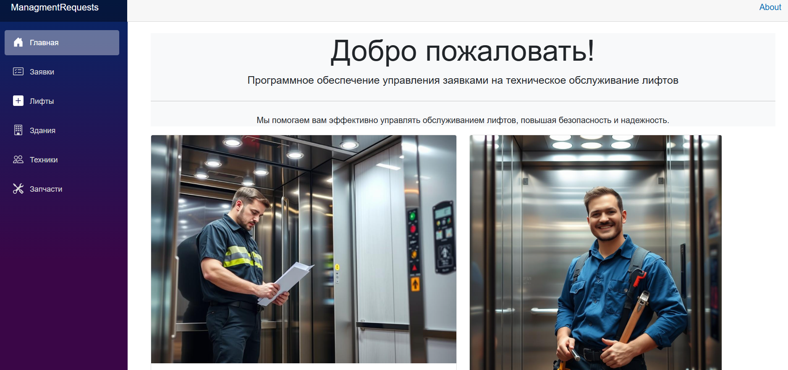
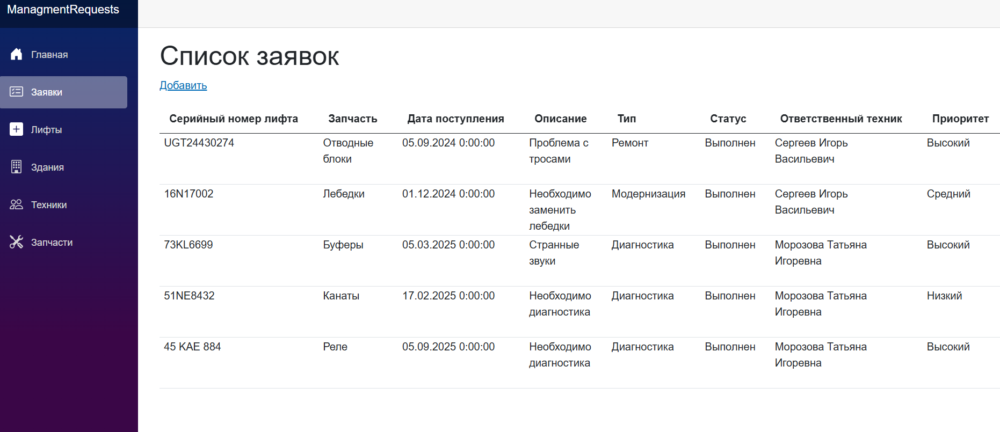
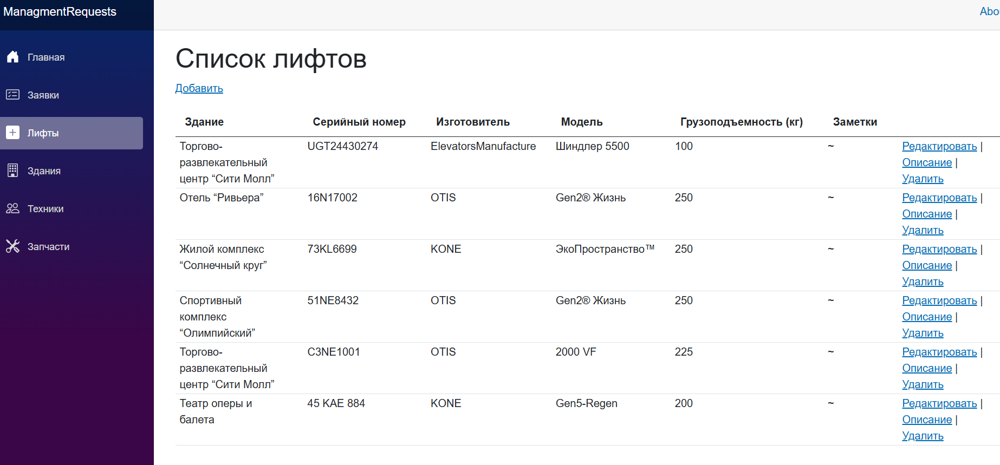
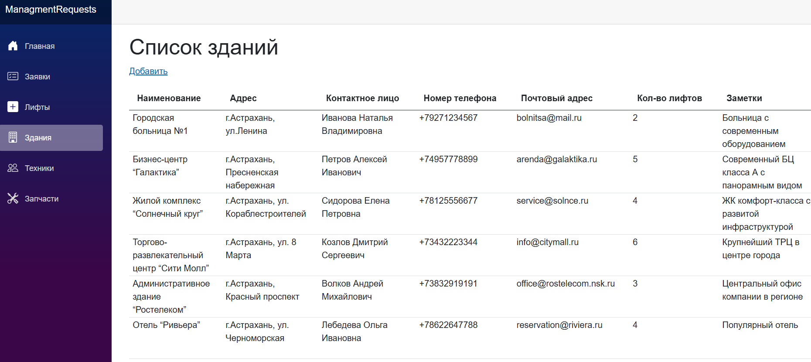
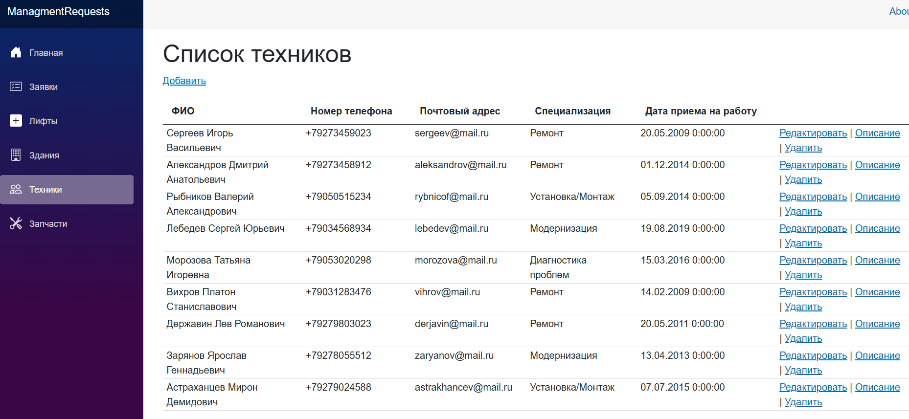
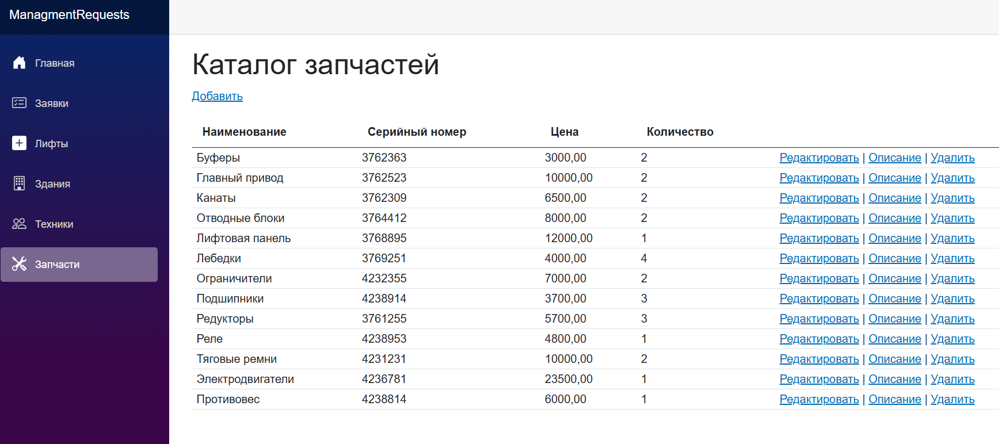

# ManagmentRequests - Система управления заявками на техническое обслуживание лифтов

## Описание

Проект выполнен с использование Visual Studio Blazor Web App C#. Целью системы является автоматизации процесса приема, обработки и администрирования заявок на техническое обслуживание лифтов.

## Особенности
Система позволяет лично вносить, редактировать и удалять информацию базы данных.

## Главное окно приложения

## Список заявок на техническое обслуживание

## Список обслуживаемых лифтов

## Список зданий

## Список сотрудников (техники)

## Запчасти

## Авторы

- Умиржанова Амира (https://github.com/umrzhnv)

